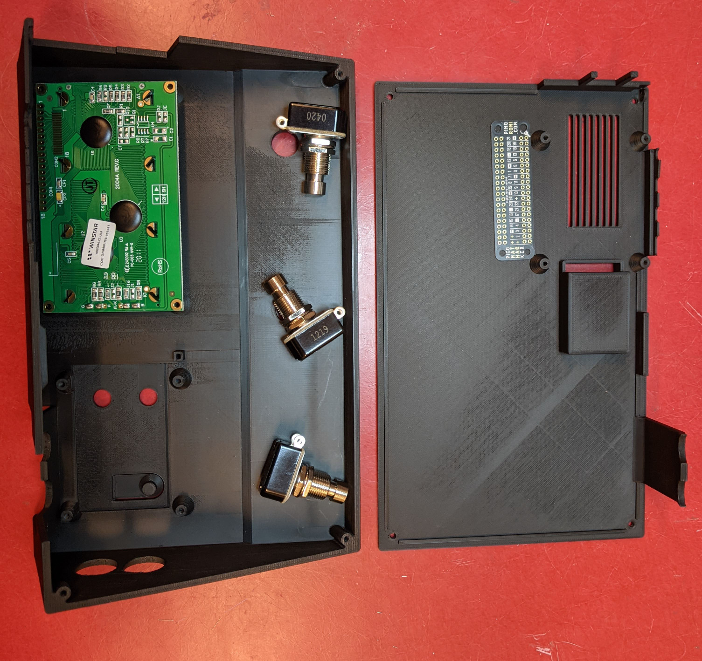
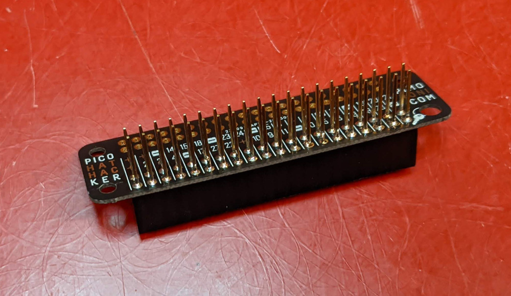
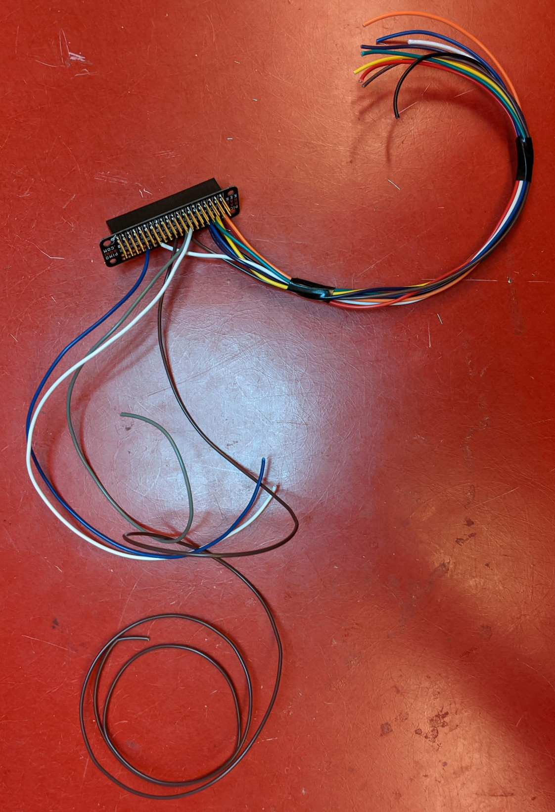
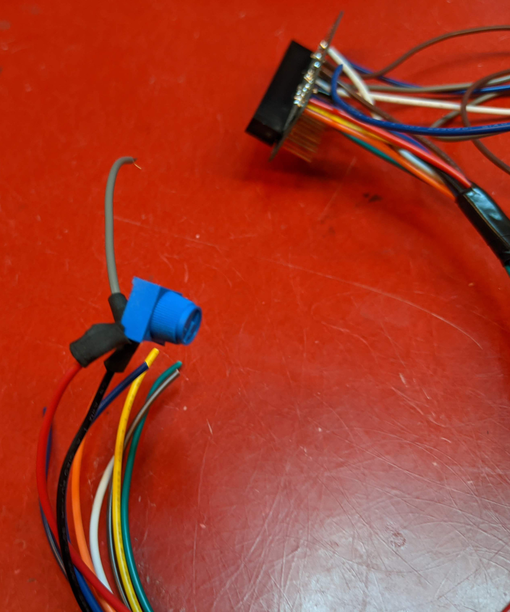
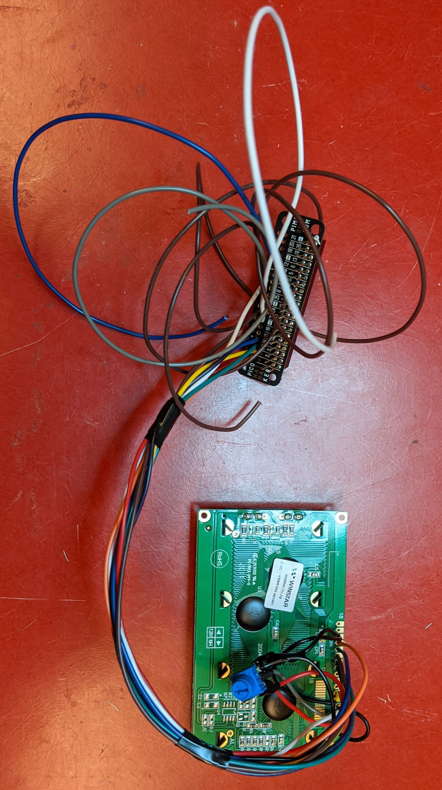
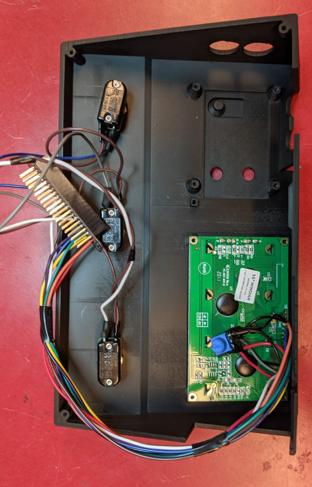
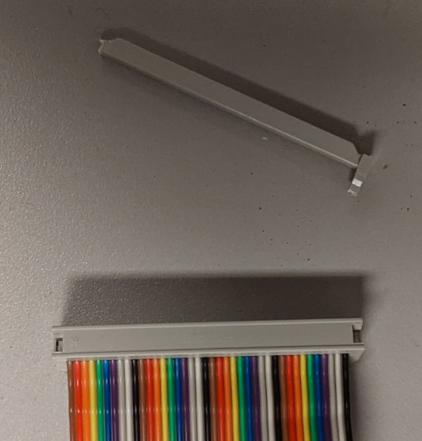
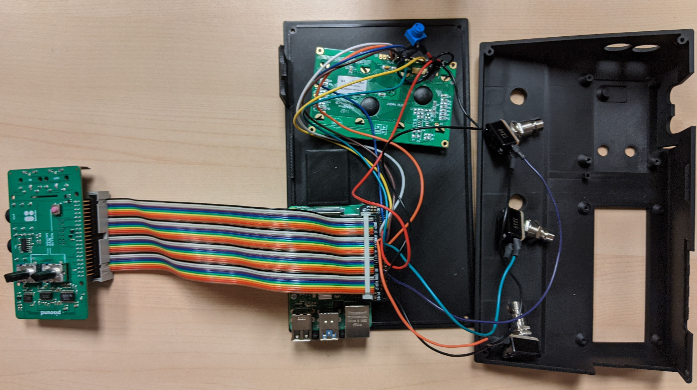
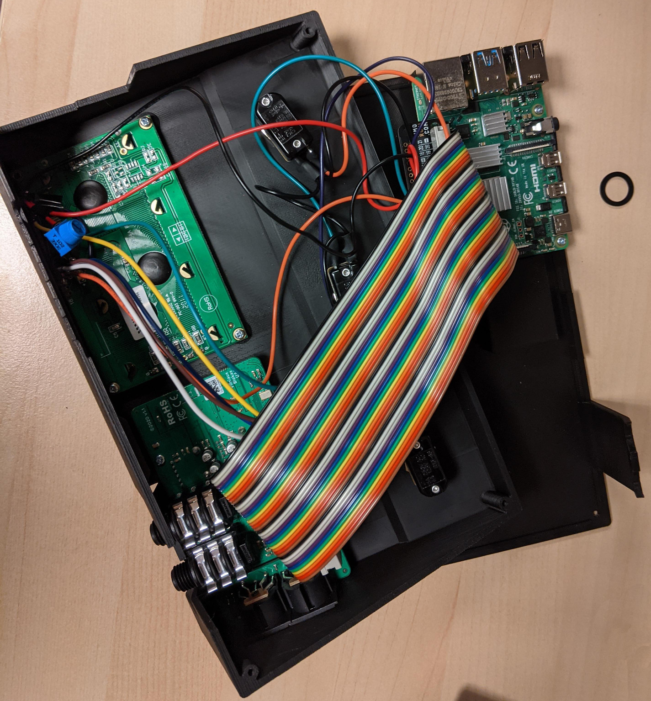
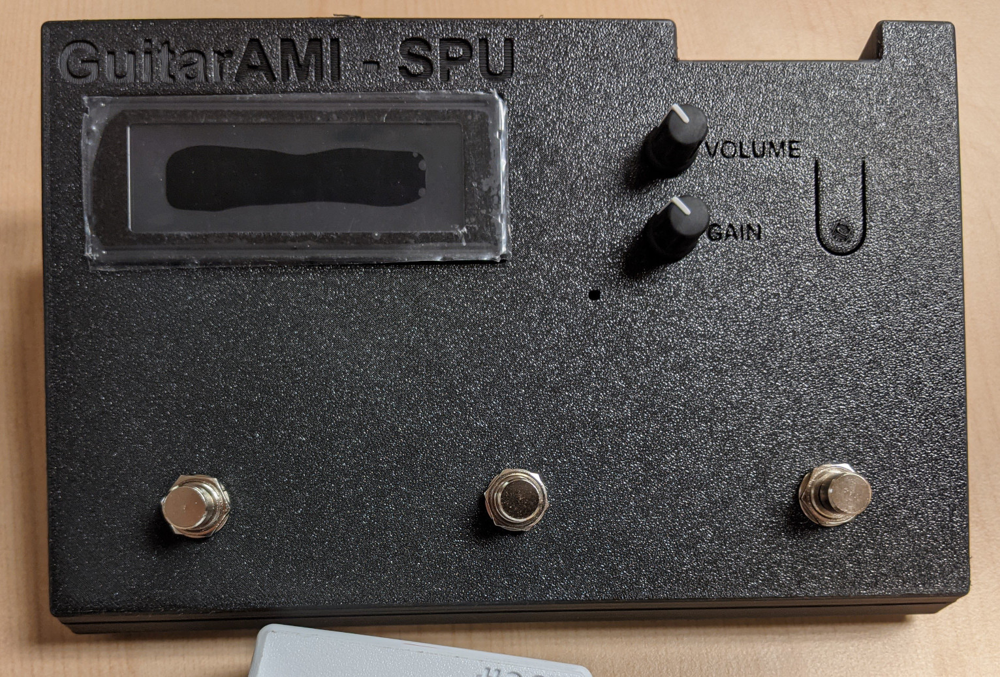

# Hardware building instructions (GuitarAMI MPU)

- [Hardware building instructions (GuitarAMI MPU)](#hardware-building-instructions-guitarami-mpu)
  - [BOM](#bom)
  - [Connections](#connections)
    - [Fe-Pi](#fe-pi)
    - [Pisound](#pisound)
  - [Instructions](#instructions)

## BOM

| Qty | Description                                          | Online Reference                                                                                     |
| --- |:-----------------------------------------------------|:---------------------------------------------------------------------------------------------------- |
| 3   | Pro-Grade SPST Momentary Foot Switch - Normally Open | https://lovemyswitches.com/pro-grade-spst-momentary-foot-switch-normally-open-soft-touch-solder-lug/ |
| 1   | RGB backlight negative LCD 20x4                      | https://www.adafruit.com/product/498#description                                                     |
| 1   | USB C Round Panel Mount Extension Cable - 30cm       | https://www.adafruit.com/product/4218                                                                |
| 1   | Pimoroni Pico HAT Hacker                             | https://www.adafruit.com/product/3577                                                                |
| 1   | Stacking Header for Pi                               | https://www.adafruit.com/product/1979                                                                |
| 8   | PAN PHILLIPS SCREW, M2.5 X 4.5 T                     | https://www.digikey.ca/en/products/detail/essentra-components/50M025045P008/11638585                 |
| 1   | Pisound                                              | https://blokas.io/pisound/                                                                           |
| 1   | Raspberry Pi 4 Model B/4GB + SD + Power + heatsinks  | https://www.buyapi.ca/product/raspberry-pi-4-model-b-4gb/                                            |
| 1   | Male to Female GPIO Ribbon Cable                     | https://www.buyapi.ca/product/male-to-female-gpio-ribbon-cable/                                      |
| 1   | 3D print filament -  PLA 1.75mm                      | https://filaments.ca/                                                                                |

## Connections

### Fe-Pi

| Raspberry Pi 4B   | LCD      | pot    | switch 1 | switch 2 | switch 3 |
| ----------------- | -------- | ------ | -------- | -------- | -------- |
| Pin 1, 3v3        |          |        |          |          |          |
| Pin 2, 5V         | 2        | right  |          |          |          |
| Pin 3, I2C.1_SDA  |          |        |          |          |          |
| Pin 4, 5V         |          |        |          |          |          |
| Pin 5, I2C.1_SCL  |          |        |          |          |          |
| Pin 6, Ground     | 1, 5, 16 | left   | left     | left     | left     |
| Pin 7, GPIO 4     |          |        |          |          |          |
| Pin 8, GPIO 14    |          |        |          |          |          |
| Pin 9, Ground     |          |        |          |          |          |
| Pin 10, GPIO 15   | 6        |        |          |          |          |
| Pin 11, GPIO 17   | 14       |        |          |          |          |
| Pin 12, GPIO 18   |          |        |          |          |          |
| Pin 13, GPIO 27   |          |        | right    |          |          |
| Pin 14, Ground    |          |        |          |          |          |
| Pin 15, GPIO 22   |          |        |          | right    |          |
| Pin 16, GPIO 23   | 13       |        |          |          |          |
| Pin 17, 3v3       | 15       |        |          |          |          |
| Pin 18, GPIO 24   | 12       |        |          |          |          |
| Pin 19, GPIO 10   |          |        |          |          |          |
| Pin 20, Ground    |          |        |          |          |          |
| Pin 21, GPIO 9    |          |        |          |          |          |
| Pin 22, GPIO 25   | 11       |        |          |          |          |
| Pin 23, GPIO 11   |          |        |          |          |          |
| Pin 24, GPIO 8    |          |        |          |          |          |
| Pin 25, Ground    |          |        |          |          |          |
| Pin 26, GPIO 7    | 4        |        |          |          |          |
| Pin 27, I2C.0_SDA |          |        |          |          |          |
| Pin 28, I2C.0_SCL |          |        |          |          |          |
| Pin 29, GPIO 5    |          |        |          |          | right    |
| Pin 30, Ground    |          |        |          |          |          |
| Pin 31, GPIO 6    |          |        |          |          |          |
| Pin 32, GPIO 12   |          |        |          |          |          |
| Pin 33, GPIO 13   |          |        |          |          |          |
| Pin 34, Ground    |          |        |          |          |          |
| Pin 35, GPIO 19   |          |        |          |          |          |
| Pin 36, GPIO 16   |          |        |          |          |          |
| Pin 37, GPIO 26   |          |        |          |          |          |
| Pin 38, GPIO 20   |          |        |          |          |          |
| Pin 39, Ground    |          |        |          |          |          |
| Pin 40, GPIO 21   |          |        |          |          |          |
|                   | 3        | middle |          |          |          |

- The audio interface is connected by the ribbon cable

### Pisound

| Raspberry Pi 4B   | LCD      | pot    | switch 1 | switch 2 | switch 3 | PiSound | Color  |
| ----------------- | -------- | ------ | -------- | -------- | -------- |:-------:|:------ |
| Pin 1, 3v3        | 15       |        |          |          |          |         | orange |
| Pin 2, 5V         | 2        | right  |          |          |          |         | red    |
| Pin 3, GPIO 2     | 6        |        |          |          |          |         | yellow |
| Pin 4, 5V         |          |        |          |          |          |         |        |
| Pin 5, GPIO 3     | 11       |        |          |          |          |         | green  |
| Pin 6, Ground     | 1, 5, 16 | left   |          |          |          |         | black  |
| Pin 7, GPIO 4     | 14       |        |          |          |          |         | blue   |
| Pin 8, GPIO 14    | 12       |        |          |          |          |         | purple |
| Pin 9, Ground     |          |        |          |          |          |         |        |
| Pin 10, GPIO 15   |          |        |          |          |          |         |        |
| Pin 11, GPIO 17   |          |        |          |          |          | X       |        |
| Pin 12, GPIO 18   |          |        |          |          |          | X       |        |
| Pin 13, GPIO 27   |          |        | right    |          |          |         | white  |
| Pin 14, Ground    |          |        |          |          |          |         |        |
| Pin 15, GPIO 22   |          |        |          | right    |          |         | gray   |
| Pin 16, GPIO 23   | 13       |        |          |          |          |         | brown  |
| Pin 17, 3v3       |          |        |          |          |          |         |        |
| Pin 18, GPIO 24   |          |        |          |          |          | X       |        |
| Pin 19, GPIO 10   |          |        |          |          |          | X       |        |
| Pin 20, Ground    |          |        | left     | left     | left     |         | black  |
| Pin 21, GPIO 9    |          |        |          |          |          | X       |        |
| Pin 22, GPIO 25   |          |        |          |          |          | X       |        |
| Pin 23, GPIO 11   |          |        |          |          |          | X       |        |
| Pin 24, GPIO 8    |          |        |          |          |          | X       |        |
| Pin 25, Ground    |          |        |          |          |          |         |        |
| Pin 26, GPIO 7    | 4        |        |          |          |          |         | white  |
| Pin 27, GPIO 0    |          |        |          |          |          |         |        |
| Pin 28, GPIO 1    |          |        |          |          |          |         |        |
| Pin 29, GPIO 5    |          |        |          |          | right    |         | blue   |
| Pin 30, Ground    |          |        |          |          |          |         |        |
| Pin 31, GPIO 6    |          |        |          |          |          | X       |        |
| Pin 32, GPIO 12   |          |        |          |          |          | X       |        |
| Pin 33, GPIO 13   |          |        |          |          |          | X       |        |
| Pin 34, Ground    |          |        |          |          |          |         |        |
| Pin 35, GPIO 19   |          |        |          |          |          | X       |        |
| Pin 36, GPIO 16   |          |        |          |          |          | X       |        |
| Pin 37, GPIO 26   |          |        |          |          |          | X       |        |
| Pin 38, GPIO 20   |          |        |          |          |          | X       |        |
| Pin 39, Ground    |          |        |          |          |          |         |        |
| Pin 40, GPIO 21   |          |        |          |          |          | X       |        |
|                   | 3        | middle |          |          |          |         | gray   |

- The audio interface is connected by the ribbon cable

## Instructions

Start by 3D printing the enclosure and arrange the parts:

Solder the long female header pins to the Pimoroni Pico HAT Hacker:

Solder the wires according to the table above.

Also, solder the potentiometer used to control the LCD backlight intensity:

Solder the wires on the LCD:

Solder the footswitches and prepare to assemble everything together:

The riboon cable needs the cape off to fit the enclosure:

The Raspberry Pi can now be secured with M2.5 screws.
The ribbon cable and the Hat Hacker are connected as shown below:

The LCD and Pisound can be secured with screws now.

Close the enclosure and we're done.

