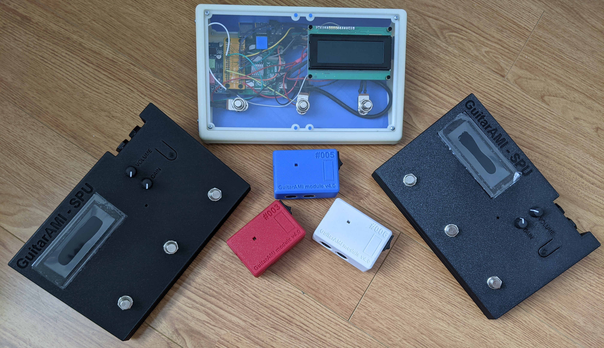
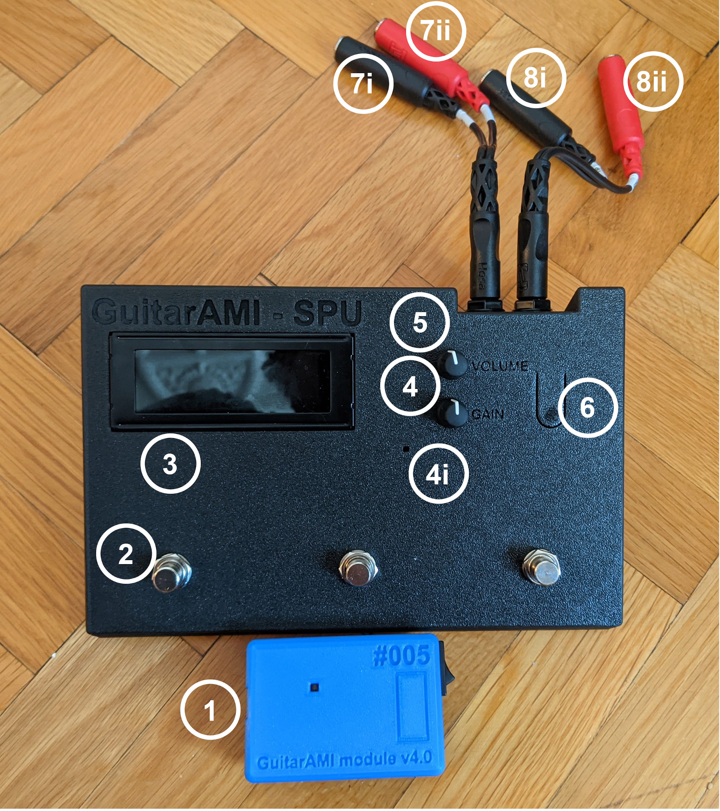
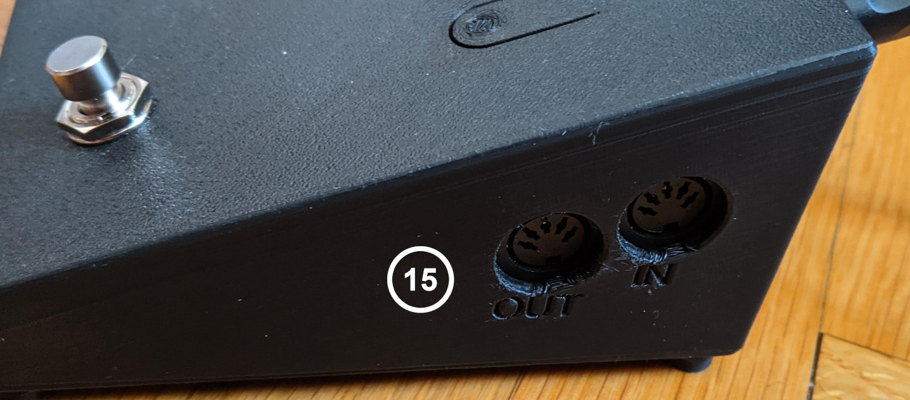
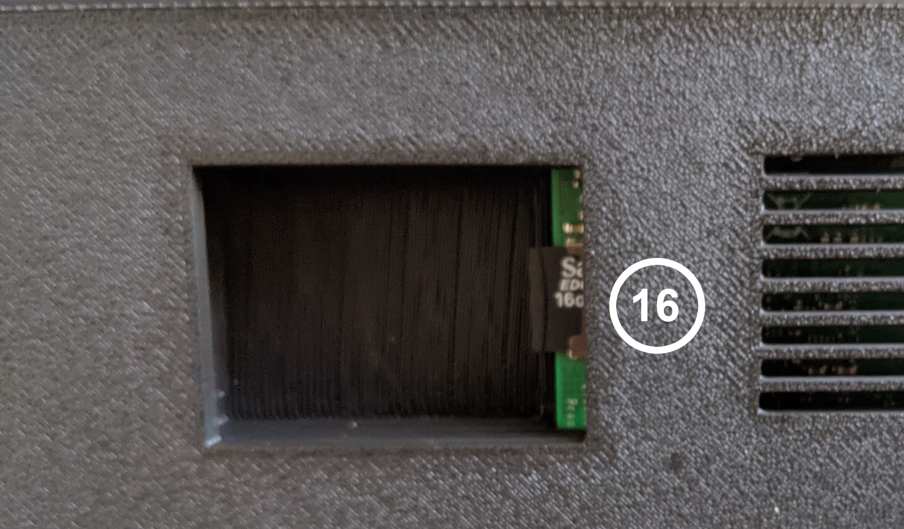
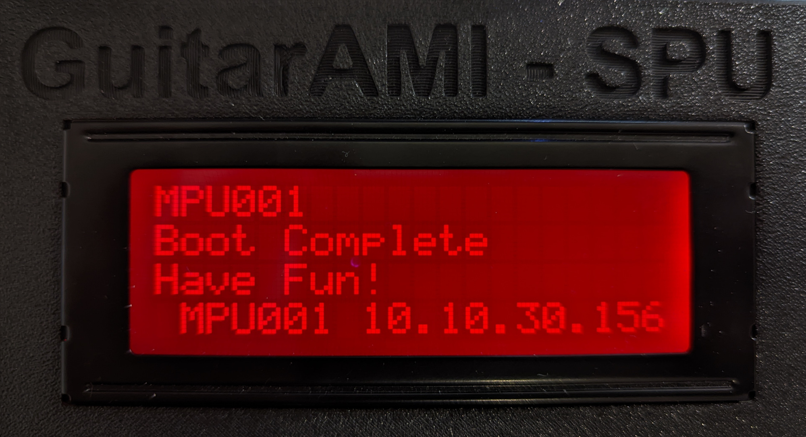
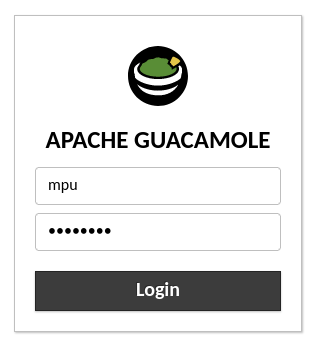
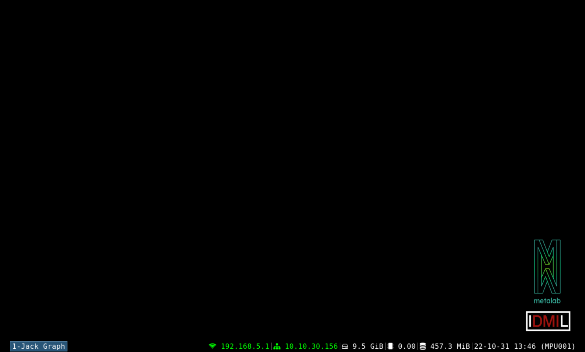
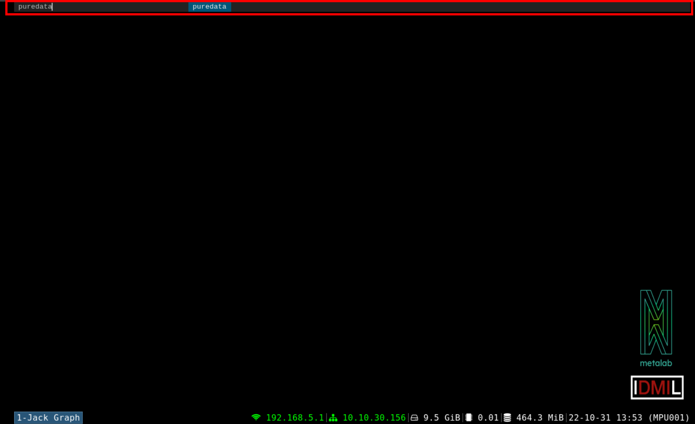
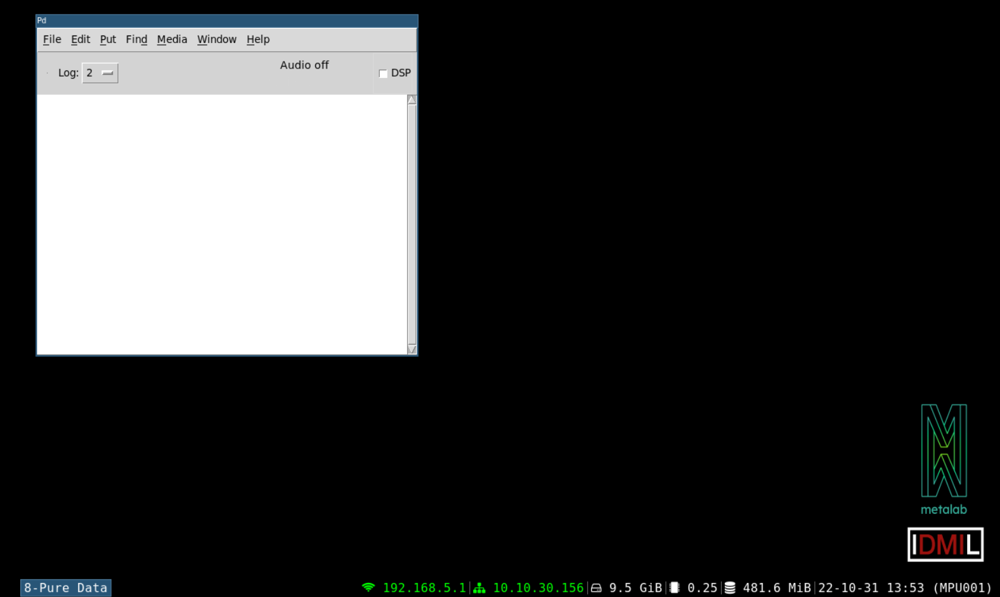
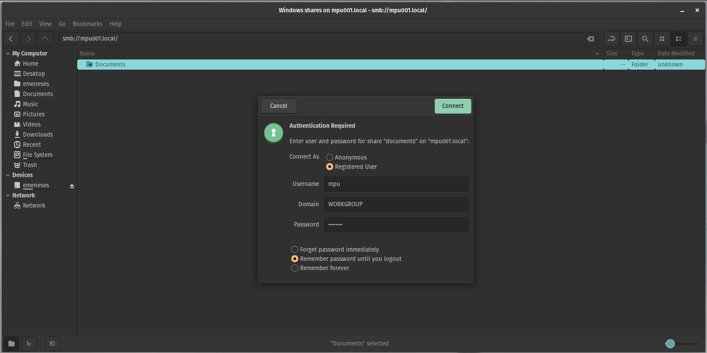

# GuitarAMI Processing Unit (MPU) user guide



- [GuitarAMI Processing Unit (MPU) user guide](#guitarami-processing-unit-mpu-user-guide)
  - [Overview](#overview)
  - [Configuring the MPU behavior](#configuring-the-mpu-behavior)
    - [Accessing the MPU](#accessing-the-mpu)
    - [uploading SuperCollider and Pure Data patches](#uploading-supercollider-and-pure-data-patches)
  - [Information about audio interfaces](#information-about-audio-interfaces)
  - [Information](#information)

## Overview

This user guide describes the GuitarAMI MPU usage, however, the software aspects of this guide are valid for any Raspberry Pi-based MPU, including MPUs set to use external audio interfaces.

The MPU is fully hackeable and runs a customized version of the [Raspberry Pi OS](https://www.raspberrypi.com/software/).

The GuitarAMI MPU overview:








1. GuitarAMI module (for reference)
2. Foot switches
3. Display
4. Gain
    1. LED clip indicator
5. Volume
6. Interface button
7. Audio INs
    1. Left (mono) input (back), equivalent to Audio IN 0 in SuperCollider
    1. Right input (red), equivalent to Audio IN 1 in SuperCollider
8. Audio OUTs
    1. Left (mono) output (back), equivalent to Audio OUT 0 in SuperCollider
    1. Right output (red), equivalent to Audio OUT 1 in SuperCollider
9. Power supply (USB-C, 5V, min 3A)
10. Micro HDMI ports
11. Audio + video composite 3.5 mm jack
12. USB 2.0 ports
13. USB 3.0 ports
14. Gigabit Ethernet port
15. MIDI IN / OUT
16. micro-SD slot

The GuitarAMI version of the MPU also has a built-in LCD display:



The display shows when the MPU finishes the booting process and provides visual feedback according to the program. The first three lines can be used freely, but the 4th line is reserved for system information:

The fourth line indicates **MPU ID**** and **ethernet IP address**.
The ID can be used to access the MPU through SSH, VNC, and VNC-over-browser.
The IP address can be used to interact with the MPU if the devices are connected through ethernet.
If using the MPU's access point (hotspot), you can use the Wi-Fi IP 192.168.5.1, configured by default.
It is also possible to change the IP address using a script located at `~/sources/MPU/scripts/chande_ipblock.sh`.

The LCD and status services come disabled by default. You can enable them with the command `sudo systemctl enable --now lcd.service status.service`.

For users connecting [Puara](https://github.com/Puara)-compatible devices, it is also advisable to have the module battery level indicated on the screen.
This information, and any other visual feedback, needs to be manually added using SuperCollider, Pure Data, or any software/language able to send OSC messages to the LCD.

## Configuring the MPU behavior

Before trying to access the MPU configuration options:

- Make sure you are in the same network as your MPU
- Connect to the **MPUXXX** network (replace XXX with your MPU's ID number). The default password is `mappings`

You can:

- Enable or disable the SuperCollider service using the command `systemctl --user enable supercollider.service`
- Enable or disable the Pure Data service using the command `sudo systemctl enable puredata.service`

Both services will run automatically on boot after being enabled and will look for `~/Documents/default.scd` and `~/Documents/default.pd` respectively.
If those files are not present, the service will disable itself until the next boot.

### Accessing the MPU

Once you connect to the MPU network, either using the AP or Ethernet cable (connect both the MPU and your computer in the same network), you can access the device using:

- VNC and VNC-over-browser with the address `mpu001.local` (change the MPU's ID accordingly)
- SSH (with or without X11-Forwarding) using `ssh -X mpu@mpu001.local` (change the MPU's ID accordingly)

For both cases, the user is **mpu** and default password **mappings**.



Once logged in, you'll see the main MPU's window:



The status bar will provide some useful information:

- Wi-Fi IP address
- Ethernet IP address
- Free disk (microSD card) space
- load average (1 min)
- used RAM
- date
- MPU's name/ID

To open any application, you can use `Alt+D` and type the name of the software, e.g. `puredata` or `scide` (for the SuperCollider IDE):



Applications registered will open in their own tabs. New applications will open o the current tab.
To change tabs one can use `Ctrl+0-9`. 



Finally, `Alt+Enter` opens a new terminal window, and most windows can be closed with either `Ctrl+Shift+Q` or a mouse middle click on the bar.

### uploading SuperCollider and Pure Data patches

Sometimes it is useful to program pathces using the laptop and deploy them later to the MPU.
The `~/Documents` folder can be accessed using a shared folder over the network (Samba share).
Windows, Linux, and macOS users should see the folder as soon as they connect to the MPU network.
This folder is password protected.
The user is **mpu** and the password **mappings**. In the picture below, the user can access the folders by clicking on `Connect as...` and entering the credentials.



## Information about audio interfaces

Internal audio interfaces using I2S should be enable automatically.
We don´t recommend installing the PiSound software as it may conflict with the configured Jack audio service.

For older Fe-Pi audio cards, it may be necessary to enable the interface manually according to the instructions available at [https://fe-pi.com/p/support-and-setup](https://fe-pi.com/p/support-and-setup) (link down in 2021/02/25).

Simply copy and paste/execute the following command:

```bash
sudo sed -i -e 's/Enable audio (loads snd_bcm2835)/Disable audio (loads snd_bcm2835)/ ; s/dtparam=audio=on/dtparam=audio=off\n\n# Enable Fe-Pi\ndtoverlay=fe-pi-audio/' /boot/config.txt
```

## Information

GuitarAMI Sound Processing Unit (MPU) - Raspberry Pi 4B + PiSound

[SAT/Metalab](https://sat.qc.ca/fr/recherche/metalab)

[Input Devices and Music Interaction Laboratory (IDMIL)](http://www.idmil.org/)

[Centre of Interdisciplinary Research In Music Media and Technology (CIRMMT)](http://www.cirmmt.org/)

October 2022 by [Edu Meneses](http://www.edumeneses.com/)
