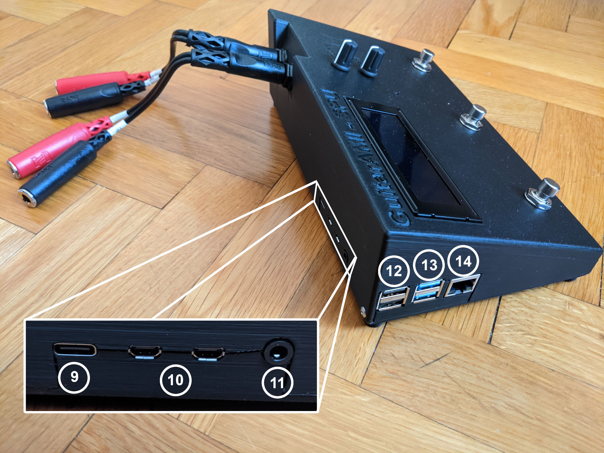
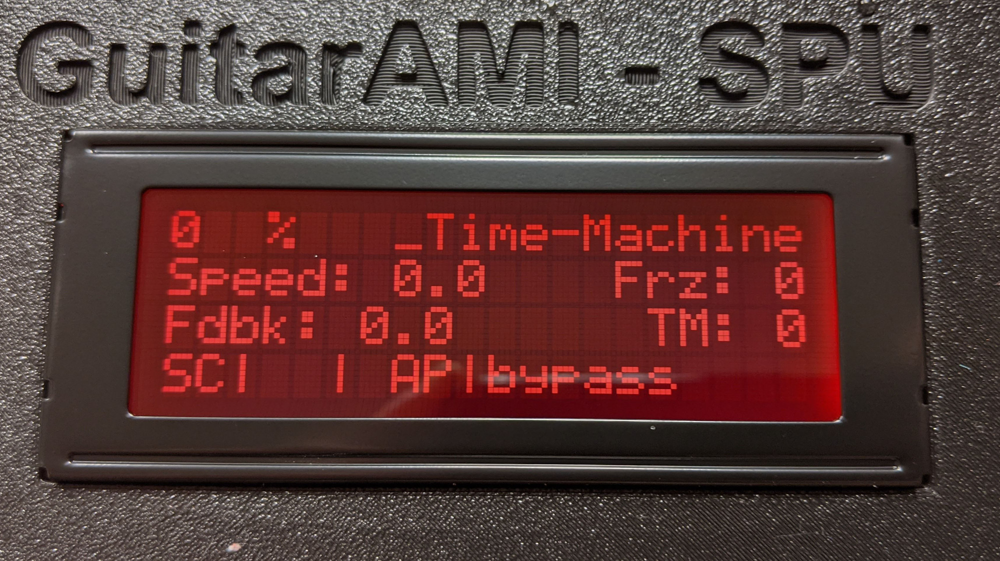
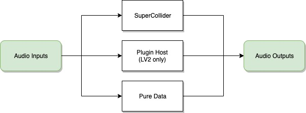
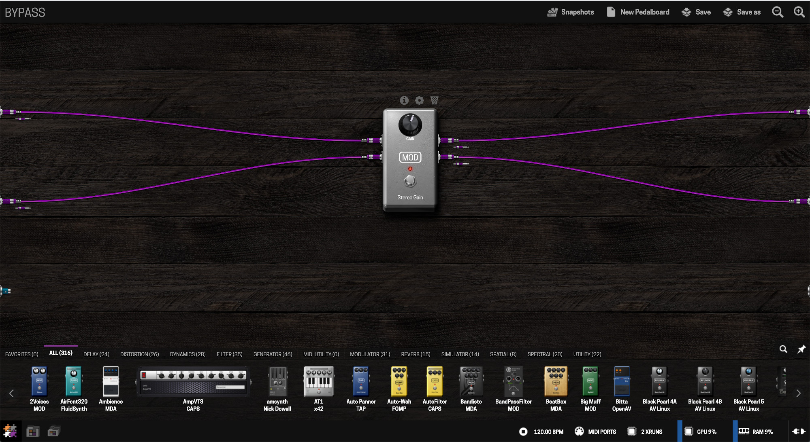
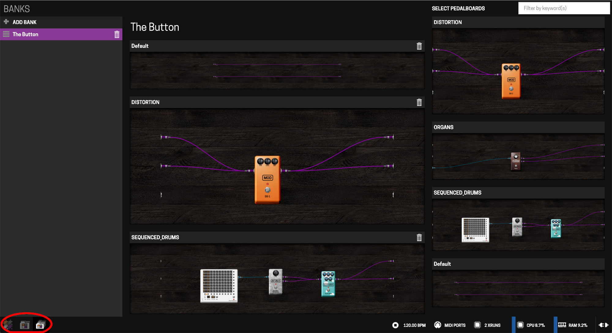

# GuitarAMI Sound Processing Unit (MPU) user guide

- [GuitarAMI Sound Processing Unit (MPU) user guide](#guitarami-sound-processing-unit-mpu-user-guide)
  - [Overview](#overview)
  - [Operation modes](#operation-modes)
    - [Standalone mode](#standalone-mode)
    - [Client mode](#client-mode)
  - [Configuring the MPU behavior](#configuring-the-mpu-behavior)
    - [Accessing the plugin host](#accessing-the-plugin-host)
    - [Accessing SuperCollider and Pure Data patches](#accessing-supercollider-and-pure-data-patches)
  - [Information](#information)

## Overview

The MPU overview:

1. GuitarAMI module (for reference)
2. Foot switches
3. Display
4. Gain
    1. LED clip indicator
5. Volume
6. Interface button
7. Audio INs
    1. Left (mono) input (back), equivalent to Audio IN 0 in SuperCollider
    1. Right input (red), equivalent to Audio IN 1 in SuperCollider
8. Audio OUTs
    1. Left (mono) output (back), equivalent to Audio OUT 0 in SuperCollider
    1. Right output (red), equivalent to Audio OUT 1 in SuperCollider
9. Power supply (USB-C, 5V, min 3A)
10. Micro HDMI ports
11. Audio + video composite 3.5 mm jack
12. USB 2.0 ports
13. USB 3.0 ports
14. Gigabit ethernet port
15. MIDI IN / OUT
16. micro-SD slot

The MPU also has a built in LCD display:

The display shows when the MPU finishes the booting process, and provide visual feedback according to the program. The first three lines can be used freely, but the 4th line is reserved for system information:

The fourth line indicates: **SC | PD | WiFi mode | Pedalboard**

- The **SC** indicator will appear if a [SuperCollider](https://supercollider.github.io/) code is running
- The **PD** indicator will appear if a [Pure Data](https://puredata.info/) patch is running
- The **WiFi mode** indicator show the WiFi operation mode: **STA** for station mode (MPU as client) and **AP** for access point (MPU as a hotspot)
- The **PedalBoard** indicator shows which pedalboard is loaded on the plugin host. Check the [Accessing the plugin host](#accessing-the-plugin-host) session for more information

It is also adviseable to have the GuitarAMI module batery level indicated on screen. This information, and any other visual feedback, needs to be manually added using SuperCollider or Pure Data. In this example, the module's batery level is indicated on the upper-left corner.

## Operation modes

To change between the modes, press and hold the interface button (6) for 3 seconds. You will see a red light under the interface button. The WiFi mode will change between **AP** and **STA** in a couple of seconds.

### Standalone mode

The MPU shows the WiFi mode as **AP**. In this mode, you can pair a GuitarAMI module (or any device sending OSC messages trough WiFi) and use the GuitarAMI without the need of a computer.

- Connect the audio INs and OUTs as desired (remember to lower the volume down as a security measure)
- Connect the MPU to the power outlet using the USB-C connector
- Wait for the MPU to boot
- Turn the paired GuitarAMI module ON
- Have fun!

### Client mode

The MPU shows the WiFi mode as **STA**. In this mode, you can use a SUpercollider or Pure Data patch to process you gestural data and send to another computer over the Network. You may also want to connect the MPU's audio INs and OUTs to your computer if you plan to have some embedded DSP processes.

> ⚠️ **Warning**: When using the GuitarAMI module in client mode, you have to configure the GuitarAMI module to connect in the same network as the MPU. Alternatively, you can send messages directly to other devices by configuring a secondary IP address and port on your GuitarAMi module to send OSC messages.

## Configuring the MPU behavior

Before trying to access the MPU configuration options:

- Make sure you are in the same network as your MPU
  - If using *standalone mode*, connect to the **MPUXXX** network (replace XXX for your MPU's ID number). The default password is `mappings`
  - If using *client mode*, connect both the MPU and the computer to the same network

The MPU is configured as follows:

You can:

- Enable or disable SuperCollider
- Enable or disable Pure Data
- Load any plugins on the plugin host. If you want to disable the plugin host you can break all audio connections

### Accessing the plugin host

Once you connect to the MPU network, you can access the LV2 plugin host by opening your web browser and typing [http://mpuXXX.local/](http://mpuXXX.local/) (replace XXX by your MPU ID number). Alternatively, you can use the MPU's IP address: [http://172.24.1.1/](http://172.24.1.1/). You will be taken to the plugin host (Modep) main page on the MPU:

The plugin is based on the [Modep](https://blokas.io/modep/) (Blokas Labs/Mod Devices). The complete documentation ca be fount at [https://blokas.io/modep/docs/](https://blokas.io/modep/docs/).

You can set 3 pedalboards at the list entitled **The Button**, and assign them to the interface button (6). Pressing the button once will load the first pedalboard on the list, pressing the button twice will load the second one, and ressing the button three times will load the third pedalboard.

To access the list, you have to choose the **banks** option (botton-left corner):

### Accessing SuperCollider and Pure Data patches

SuperCollider and Pure Data files can be accessed using a shared folder over the network. Windows, Linux, and macOS users should see the folders as soon as you connect to the MPU network. These folders are password protected. The user is **patch** and the password **mappings**. In the picture below, the user can access the folders by clicking on `Connect as...` and entering the credentials.

They can also be accessed manually. An example of manual access using macOS on the MPU005:

Open Finder, click in `Go` and in `Connect to Server...`

Type the MPUXXX address:

Confirm the server name:

Enter credentials:

Choose the **MPUXXX-Patches** folder:

The **default.scd** and **default.pd** files will load automatically on boot. If you don't want to start Supercollider or Pure Data on boot, rename the files to any other name. You can edit the files in your computer, amke backup copies or add new patches to this folder.

## Information

GuitarAMI Sound Processing Unit (MPU) - Raspberry Pi 4B + PiSound
[Input Devices and Music Interaction Laboratory (IDMIL)](http://www.idmil.org/)
[Centre of Interdisciplinary Research In Music Media and Technology (CIRMMT)](http://www.cirmmt.org/)
February 2021 by [Edu Meneses](http://www.edumeneses.com/)
